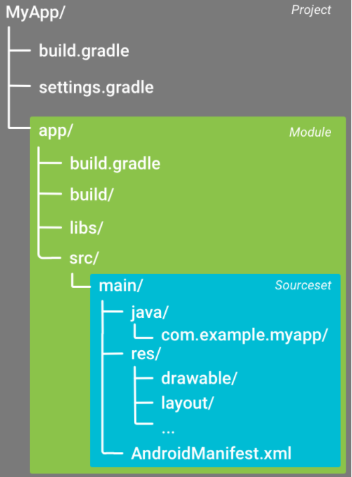

# Android Studio项目结构

## 总览

## Project级别

文件/文件夹名 |描述
--------|--------------------------------
.gradle |Gradle编译系统，版本由Wrapper指定
.idea|Android Studio IDE所需要的文件
build   |构建输出
gradle/gradle-wrapper.jar|Wrapper的可执行JAR，Wrapper代码存储的地方
gradle/gradle-wrapper.properties|一个属性文件，用于配置wrapper
.gitignore|git使用的ignore文件
build.gradle|定义适用于所有模块的构建配置。此文件已集成到项目中，因此您应当在所有其他源代码的修订控制中保留这个文件
gradle.properties|可以在其中配置项目范围 Gradle 设置，例如 Gradle 后台进程的最大堆大小
gradlew|Linux/Unix 用户可用来执行Gradle tasks的shell script
graldew.bat|Windows 用户可用来执行Gradle tasks的bat script
local.properties|为构建系统配置本地环境属性，例如 SDK 安装路径。由于该文件的内容由 Android Studio 自动生成并且专用于本地开发者环境，因此您不应手动修改该文件，或将其纳入您的版本控制系统
settings.gradle|用于指示 Gradle 在构建应用时应将哪些模块包括在内

## Module级别

文件/文件夹名|描述
------|------
build|构建输出
libs|依赖的库所在的位置（jar和aar)
src|包含模块的所有代码和资源文件
src/androidTest|包含在 Android 设备上运行的仪器测试的代码
src/test|包含在您的主机 JVM 上运行的本地测试的代码
src/main|包含“主”源集文件：所有构建变体共享的 Android 代码和资源（其他构建变体的文件位于同级目录中，例如调试构建类型的文件位于 src/debug/ 中）
src/main/java|包含 Java 代码源
src/main/res|包含应用资源，例如可绘制对象文件、布局文件和 UI 字符串。
src/main/assets|包含应原封不动地编译到.apk文件中的文件。您可以使用 URI 像浏览典型文件系统一样浏览此目录，以及使用AssetManager以字节流形式读取文件。例如，此位置非常适合纹理和游戏数据
src/main/AndroidManifest.xml|说明应用及其每个组件的性质。
src/main/jni|包含使用 Java 原生接口 (JNI) 的原生代码
src/main/jniLibs|jni的一些动态库所在的默认位置(.so文件)
src/main/gen\包含 Android Studio 生成的 Java 文件，例如您的 R.java 文件以及从 AIDL 文件创建的接口
build.gradle|定义模块特定的构建配置
proguard-rules.pro|混淆规则文件

