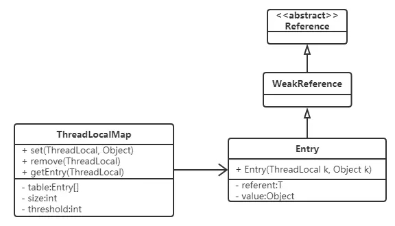

# Java学习笔记
## 基本操作
### 异常处理机制 (try,catch,finally)

Java通过面向对象的方法来处理例外。在一个方法的运行过程中，如果发生了例外，则这个方法生成代表该例外的一个对象，并把它交给运行时系统，运行时系统寻找相应的代码来处理这一例外。我们把生成例外对象并把它提交给运行时系统的过程称为**抛弃(throw)一个例外**。运行时系统在方法的调用栈中查找，从生成例外的方法开始进行回朔，直到找到包含相应例外处理的方法为止，这一个过程称为**捕获(catch)一个例外**。

    boolean test() throws Exception
    {
        try
        {
        //代码区
        }
        catch(Exception e)
        {
        //异常处理
        }
        finally
        {
        //提供统一出口,可进行资源的清除工作
        }
    }
代码区如果有错误，就会返回所写异常的处理。

如果`try`由于其他原因`R`突然中止（而非抛出异常`v`），那么`finally`块被执行，分为两种情况：
 
- 如果`finally`块执行顺利，那么整个`try-catch-finally`程序块的结局是“由于原因R突然中止（completes abruptly）”。
- 如果`finally`块由于原因`S`突然中止，那么整个`try-catch-finally`程序块的结局是“由于原因S突然中止（completes abruptly）”，原因`R`将被抛弃。

### Java中四种引用
#### 强引用

　最常用到的引用类型，`StrongRerence`类其实并不存在，而是在JVM底层实现。如果一个对象具有强引用，它就不会被垃圾回收器回收。即使当前内存空间不足，JVM也不会回收它，而是抛出 `OutOfMemoryError`错误，使程序异常终止。如果想中断强引用和某个对象之间的关联，可以显式地将引用赋值为`null`，这样一来的话，JVM在合适的时间就会回收该对象。
```Java
String str = "hello";    // 强引用
str = null;              // 取消强引用
```
#### 软引用

　　在使用软引用时，如果内存的空间足够，软引用就能继续被使用，而不会被垃圾回收器回收；只有在内存空间不足时，软引用才会被垃圾回收器回收。所以软引用的这种特性，一般用来实现一些内存敏感的缓存，只要内存空间足够，对象就会保持不被回收掉，比如网页缓存、图片缓存等。
```Java
SoftReference<String> softName = new  SoftReference<>("张三");
```
#### 弱引用

　　具有弱引用的对象拥有的生命周期更短暂。因为当 JVM 进行垃圾回收，一旦发现弱引用对象，无论当前内存空间是否充足，都会将弱引用回收。不过由于垃圾回收器是一个优先级较低的线程，所以并不一定能迅速发现弱引用对象。
```Java
WeakReference<String> weakName = new WeakReference<String>("hello");
```
#### 虚引用

　　顾名思义，就是形同虚设，如果一个对象仅持有虚引用，那么它相当于没有引用，在任何时候都可能被垃圾回收器回收。

　　虚引用必须和引用队列关联使用，当垃圾回收器准备回收一个对象时，如果发现它还有虚引用，就会把这个虚引用加入到与之关联的引用队列中。程序可以通过判断引用队列中是否已经加入了虚引用，来了解被引用的对象是否将要被垃圾回收。如果程序发现某个虚引用已经被加入到引用队列，那么就可以在所引用的对象的内存被回收之前采取必要的行动。
```Java
ReferenceQueue<String> queue = new ReferenceQueue<String>();
PhantomReference<String> pr = new PhantomReference<String>(new String("hello"), queue);
```

### ThreadLocal
在并发编程的时候，成员变量如果不做任何处理其实是线程不安全的，各个线程都在操作同一个变量，显然是不行的，并且我们也知道`volatile`这个关键字也是不能保证线程安全的。那么在有一种情况之下，我们需要满足这样一个条件：变量是同一个，但是每个线程都使用同一个初始值，也就是使用同一个变量的一个新的副本。这种情况之下`ThreadLocal`就非常实用。

`ThreadLocal`是一个本地线程副本变量工具类。主要用于将私有线程和该线程存放的副本对象做一个映射，各个线程之间的变量互不干扰，在高并发场景下，可以实现无状态的调用，特别适用于各个线程依赖不通的变量值完成操作的场景。

> `ThreadLocal`和线程同步机制都是为了解决多线程中相同变量的访问冲突问题。
> 
> 　　在同步机制中，通过对象的锁机制保证同一时间只有一个线程访问变量。这时该变量是多个线程共享的，使用同步机制要求程序慎密地分析什么时候对变量进行读写，什么时候需要锁定某个对象，什么时候释放对象锁等繁杂的问题，程序设计和编写难度相对较大。
> 
> 　　而`ThreadLocal`则从另一个角度来解决多线程的并发访问。`ThreadLocal`会为每一个线程提供一个独立的变量副本，从而隔离了多个线程对数据的访问冲突。因为每一个线程都拥有自己的变量副本，从而也就没有必要对该变量进行同步了。`ThreadLocal`提供了线程安全的共享对象，在编写多线程代码时，可以把不安全的变量封装进`ThreadLocal`。
> 
> 　　概括起来说，对于多线程资源共享的问题，同步机制采用了“以时间换空间”的方式，而`ThreadLocal`采用了“以空间换时间”的方式。前者仅提供一份变量，让不同的线程排队访问，而后者为每一个线程都提供了一份变量，因此可以同时访问而互不影响。

　　1、每个Thread对象内部都维护了一个`ThreadLocalMap`这样一个`ThreadLocal`的`Map`，可以存放若干个`ThreadLocal`。
```Java
/* ThreadLocal values pertaining to this thread. This map is maintained
 * by the ThreadLocal class. */
ThreadLocal.ThreadLocalMap threadLocals = null;
```


　　2、`set()`方法
```Java
public void set(T value) {
    Thread t = Thread.currentThread(); // 获取当前线程
    ThreadLocalMap map = getMap(t); // 拿到当前线程的 ThreadLocalMap
    if (map != null) // 判断 ThreadLocalMap 是否存在
        map.set(this, value); // 调用 ThreadLocalMap 的 set 方法
    else
        createMap(t, value); // 创建 ThreadLocalMap
}

ThreadLocalMap getMap(Thread t) {
    return t.threadLocals;
}

void createMap(Thread t, T firstValue) {
    t.threadLocals = new ThreadLocalMap(this, firstValue);
}
```

　　3、当我们在调用`get()`方法的时候，先获取当前线程，然后获取到当前线程的`ThreadLocalMap`对象，如果非空，那么取出`ThreadLocal`的`value`，否则进行初始化，初始化就是将`initialValue`的值`set`到`ThreadLocal`中。
```Java
public T get() {
    Thread t = Thread.currentThread();
    ThreadLocalMap map = getMap(t);
    if (map != null) {
        ThreadLocalMap.Entry e = map.getEntry(this);
        if (e != null)
            return (T)e.value;
    }
    return setInitialValue();
}

private T setInitialValue() {
    T value = initialValue();
    Thread t = Thread.currentThread();
    ThreadLocalMap map = getMap(t);
    if (map != null)
        map.set(this, value);
    else
        createMap(t, value);
    return value;
}

protected T initialValue() {
    return null;
}
```
　　4、`remove()`方法
```Java
public void remove() {
    ThreadLocalMap m = getMap(Thread.currentThread());
    if (m != null)
        m.remove(this); // 调用ThreadLocalMap的remove方法
}
```
　　5、`ThreadLocalMap`是`ThreadLocal`内部的一个`Map`实现，然而它并没有实现任何集合的接口规范，因为它仅供内部使用，数据结构采用数组+开方地址法，`Entry`继承`WeakReference`，是基于`ThreadLocal`这种特殊场景实现的`Map`。在`ThreadLocalMap`中，是用`Entry`来保存K-V结构数据的。但是`Entry`中`key`只能是`ThreadLocal`对象，这点可见`Entry`的构造方法。
```Java
static class Entry extends WeakReference<ThreadLocal> {
    /** The value associated with this ThreadLocal. */
    Object value;

    Entry(ThreadLocal k, Object v) {
        super(k);
        value = v;
    }
}
```

- 总结：当我们调用`get()`方法的时候，其实每个当前线程中都有一个`ThreadLocal`。每次获取或者设置都是对该`ThreadLocal`进行的操作，是与其他线程分开的。
- 应用场景：当很多线程需要多次使用同一个对象，并且需要该对象具有相同初始化值的时候最适合使用`ThreadLocal`。

事实上，从本质来讲，每个线程都维护了一个`map`，而这个`map`的`key`就是`threadLocal`，而值`set`就是我们的那个值，每次线程在`get`的时候，都从自己的变量中取值，既然从自己的变量中取值，那肯定就不存在线程安全问题，总体来讲，`ThreadLocal`这个变量的状态根本没有发生变化，他仅仅是充当一个`key`的角色，另外提供给每一个线程一个初始值。如果允许的话，我们自己就能实现一个这样的功能，只不过恰好JDK就已经帮我们做了这个事情。

## JVM

### Java内存模型（JMM--Java Memory Model）
Java的内存模型可以理解为：在特定的协议下，对特定的内存和高级缓存进行读写访问的过程抽象，不同操作系统有不同的内存模型也就是过程抽象。Java虚拟机（JVM）也有自己的内存模型，也就是Java内存模型了。因为Java内存模型屏蔽了各种硬件和操作系统的差异，也就形成了大家众所周知的**一次编写，到处运行**。

Java内存模型的主要目标是定义程序中各个变量的访问规则，即在虚拟机中将变量存储到内存和从内存中取出变量这样底层细节。此处的变量与Java编程时所说的变量不一样，指包括了实例字段、静态字段和构成数组对象的元素，但是不包括局部变量与方法参数，后者是线程私有的，不会被共享。

Java内存模型中规定了所有的变量都存储在主内存中，每条线程还有自己的工作内存（可以与前面讲的处理器的高速缓存类比），线程的工作内存中保存了该线程使用到的变量到主内存副本拷贝，线程对变量的所有操作（读取、赋值）都必须在工作内存中进行，而不能直接读写主内存中的变量。不同线程之间无法直接访问对方工作内存中的变量，线程间变量值的传递均需要在主内存来完成，线程、主内存和工作内存的交互关系如下图所示。


如上图所示，可以看出来内存交互中有八步的操作：lock、Unlock、Read、 Load、 Use、 Assign、 Store、 Write其中Read和Load  Store和Write必必须按顺序执行，而没有保证必须是连续执行。另外还有Java内存模型的八项规则：

- 不允许read和load、store和write操作之一单独出现
- 不允许一个线程丢弃它的最近assign的操作，即变量在工作内存中改变了之后必须同步到主内存中。
- 不允许一个线程无原因地（没有发生过任何assign操作）把数据从工作内存同步回主内存中。
- 一个新的变量只能在主内存中诞生，不允许在工作内存中直接使用一个未被初始化（load或assign）的变量。即就是对一个变量实施use和store操作之前，必须先执行过了assign和load操作。
- 一个变量在同一时刻只允许一条线程对其进行lock操作，lock和unlock必须成对出现
- 如果对一个变量执行lock操作，将会清空工作内存中此变量的值，在执行引擎使用这个变量前需要重新执行load或assign操作初始化变量的值
- 如果一个变量事先没有被lock操作锁定，则不允许对它执行unlock操作；也不允许去unlock一个被其他线程锁定的变量。
- 对一个变量执行unlock操作之前，必须先把此变量同步到主内存中（执行store和write操作）。
