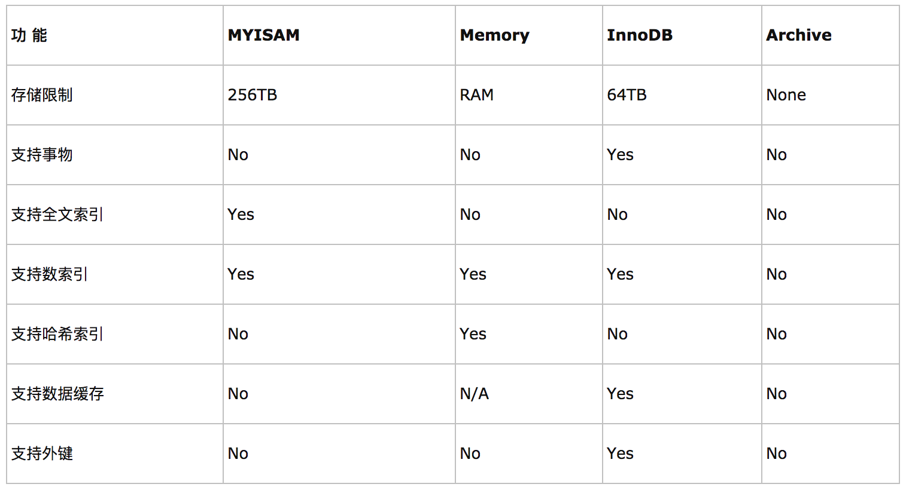
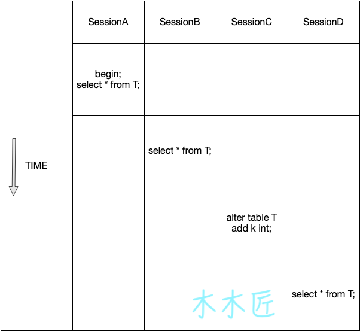

# 数据库
## 事务
#### ACID

- **A 事务的原子性(Atomicity)**：指一个事务要么全部执行，要么不执行。也就是说一个事务不可能只执行了一半就停止了。比如从取款机取钱，这个事务可以分成两个步骤:1划卡，2出钱.不可能划了卡，而钱却没出来。这两步必须同时完成.要么就不完成。
- **C 事务的一致性(Consistency)**：指事务的运行并不改变数据库中数据的一致性。例如,完整性约束了a+b=10，一个事务改变了a，那么b也应该随之改变。
- **I 事务的独立性(Isolation）**：事务的独立性也有称作隔离性，是指两个以上的事务不会出现交错执行的状态。因为这样可能会导致数据不一致。
- **D 事务的持久性(Durability）**：事务的持久性是指事务执行成功以后，该事务所对数据库所作的更改便是持久的保存在数据库之中，不会无缘无故的回滚。

#### 并发事务带来的问题
在典型的应用程序中，多个事务并发运行，经常会操作相同的数据来完成各自的任务（多个用户对统一数据进行操作）。并发虽然是必须的，但可能会导致以下的问题。

- **脏读（Dirty read）**: 当一个事务正在访问数据并且对数据进行了修改，而这种修改还没有提交到数据库中，这时另外一个事务也访问了这个数据，然后使用了这个数据。因为这个数据是还没有提交的数据，那么另外一个事务读到的这个数据是“脏数据”，依据“脏数据”所做的操作可能是不正确的。
- **丢失修改（Lost to modify）**: 指在一个事务读取一个数据时，另外一个事务也访问了该数据，那么在第一个事务中修改了这个数据后，第二个事务也修改了这个数据。这样第一个事务内的修改结果就被丢失，因此称为丢失修改。	例如：事务1读取某表中的数据A=20，事务2也读取A=20，事务1修改A=A-1，事务2也修改A=A-1，最终结果A=19，事务1的修改被丢失。
- **不可重复读（Unrepeatableread）**: 指在一个事务内多次读同一数据。在这个事务还没有结束时，另一个事务也访问该数据。那么，在第一个事务中的两次读数据之间，由于第二个事务的修改导致第一个事务两次读取的数据可能不太一样。这就发生了在一个事务内两次读到的数据是不一样的情况，因此称为不可重复读。
- **幻读（Phantom read）**: 幻读与不可重复读类似。它发生在一个事务（T1）读取了几行数据，接着另一个并发事务（T2）插入了一些数据时。在随后的查询中，第一个事务（T1）就会发现多了一些原本不存在的记录，就好像发生了幻觉一样，所以称为幻读。

#### 事务隔离
事务的隔离级别有4种：

- Read uncommitted：会出现脏读，不可重复读，幻读
- Read committed：会出现不可重复读，幻读
- Repeatable read：会出现幻读(但在Mysql实现的Repeatable read配合gap锁不会出现幻读！)
- Serializable：串行，避免以上所有情况

## 数据库引擎

数据库存储引擎是数据库底层软件组织，数据库管理系统（DBMS）使用数据引擎进行创建、查询、更新和删除数据。不同的存储引擎提供不同的存储机制、索引技巧、锁定水平等功能，使用不同的存储引擎，还可以获得特定的功能。现在许多不同的数据库管理系统都支持多种不同的数据引擎。**MySQL的核心就是存储引擎**。

#### ISAM
ISAM是一个定义明确且历经时间考验的数据表格管理方法，它在设计之时就考虑到数据库被查询的次数要远大于更新的次数。因此，**ISAM执行读取操作的速度很快，而且不占用大量的内存和存储资源**。

ISAM的两个主要不足之处在于，它**不支持事务处理，也不能够容错**：如果你的硬盘崩溃了，那么数据文件就无法恢复了。如果你正在把ISAM用在关键任务应用程序里，那就必须经常备份你所有的实 时数据，通过其复制特性，MYSQL能够支持这样的备份应用程序。

#### MyISAM存储引擎

MyISAM基于ISAM存储引擎，并对其进行扩展。它是在Web、数据仓储和其他应用环境下最常使用的存储引擎之一。MyISAM**拥有较高的插入、查询速度，但不支持事物**。MyISAM主要特性有：

1、大文件（达到63位文件长度）在支持大文件的文件系统和操作系统上被支持

2、当把删除和更新及插入操作混合使用的时候，动态尺寸的行产生更少碎片。这要通过合并相邻被删除的块，以及若下一个块被删除，就扩展到下一块自动完成

3、每个MyISAM表最大索引数是64，这可以通过重新编译来改变。每个索引最大的列数是16

4、最大的键长度是1000字节，这也可以通过编译来改变，对于键长度超过250字节的情况，一个超过1024字节的键将被用上

5、BLOB和TEXT列可以被索引

6、NULL被允许在索引的列中，这个值占每个键的0~1个字节

7、所有数字键值以高字节优先被存储以允许一个更高的索引压缩

8、每个MyISAM类型的表都有一个AUTO\_INCREMENT的内部列，当INSERT和UPDATE操作的时候该列被更新，同时AUTO\_INCREMENT列将被刷新。所以说，MyISAM类型表的AUTO\_INCREMENT列更新比InnoDB类型的AUTO\_INCREMENT更快

9、可以把数据文件和索引文件放在不同目录

10、每个字符列可以有不同的字符集

11、有VARCHAR的表可以固定或动态记录长度

12、VARCHAR和CHAR列可以多达64KB

使用MyISAM引擎创建数据库，将产生3个文件。文件的名字以表名字开始，扩展名之处文件类型：frm文件存储表定义、数据文件的扩展名为.MYD（MYData）、索引文件的扩展名时.MYI（MYIndex）

### InnoDB存储引擎

InnoDB是事务型数据库的首选引擎，**支持事务安全表（ACID），支持行锁定和外键，默认的MySQL引擎**。InnoDB主要特性有：

1、InnoDB给MySQL**提供了具有提交、回滚和崩溃恢复能力的事物安全（ACID兼容）存储引擎**。InnoDB锁定在行级并且也在SELECT语句中提供一个类似Oracle的非锁定读。这些功能增加了多用户部署和性能。在SQL查询中，可以自由地将InnoDB类型的表和其他MySQL的表类型混合起来，甚至在同一个查询中也可以混合

2、InnoDB是**为处理巨大数据量的最大性能设计**。它的CPU效率可能是任何其他基于磁盘的关系型数据库引擎锁不能匹敌的

3、InnoDB存储引擎完全与MySQL服务器整合，InnoDB存储引擎为在主内存中缓存数据和索引而维持它自己的缓冲池。InnoDB将它的表和索引在一个逻辑表空间中，表空间可以包含数个文件（或原始磁盘文件）。这与MyISAM表不同，比如在MyISAM表中每个表被存放在分离的文件中。InnoDB表可以是任何尺寸，即使在文件尺寸被限制为2GB的操作系统上

4、InnoDB**支持外键完整性约束**，存储表中的数据时，每张表的存储都按主键顺序存放，如果没有显示在表定义时指定主键，InnoDB会为每一行生成一个6字节的ROWID，并以此作为主键

5、InnoDB被用在众多需要**高性能**的大型数据库站点上

InnoDB不创建目录，使用InnoDB时，MySQL将在MySQL数据目录下创建一个名为ibdata1的10MB大小的自动扩展数据文件，以及两个名为ib_logfile0和ib_logfile1的5MB大小的日志文件

#### MEMORY存储引擎

MEMORY存储引擎将表中的数据存储到内存中，未查询和引用其他表数据提供快速访问。MEMORY主要特性有：

1、MEMORY表的每个表可以有多达32个索引，每个索引16列，以及500字节的最大键长度

2、MEMORY存储引擎执行HASH和B-Tree缩影

3、可以在一个MEMORY表中有非唯一键值

4、MEMORY表使用一个固定的记录长度格式

5、MEMORY不支持BLOB或TEXT列

6、MEMORY支持AUTO_INCREMENT列和对可包含NULL值的列的索引

7、MEMORY表在所由客户端之间共享（就像其他任何非TEMPORARY表）

8、MEMORY表内存被存储在内存中，内存是MEMORY表和服务器在查询处理时的空闲中，创建的内部表共享

9、当不再需要MEMORY表的内容时，要释放被MEMORY表使用的内存，应该执行DELETE FROM或TRUNCATE TABLE，或者删除整个表（使用DROP TABLE）

#### 存储引擎的选择

不同的存储引擎都有各自的特点，以适应不同的需求，如下表所示：



- 如果要提供提交、回滚、崩溃恢复能力的事物安全（ACID兼容）能力，并要求实现并发控制，InnoDB是一个好的选择
- 如果数据表主要用来插入和查询记录，则MyISAM引擎能提供较高的处理效率
- 如果只是临时存放数据，数据量不大，并且不需要较高的数据安全性，可以选择将数据保存在内存中的Memory引擎，MySQL中使用该引擎作为临时表，存放查询的中间结果
- 如果只有INSERT和SELECT操作，可以选择Archive，Archive支持高并发的插入操作，但是本身不是事务安全的。Archive非常适合存储归档数据，如记录日志信息可以使用Archive

使用哪一种引擎需要灵活选择，一个数据库中多个表可以使用不同引擎以满足各种性能和实际需求，使用合适的存储引擎，将会提高整个数据库的性能。

### MySQL引擎查看与修改
#### 查看当前数据库支持的引擎：

    show engines;

#### 如果要想查看数据库默认使用哪个引擎，可以通过使用命令：

    SHOW VARIABLES LIKE 'storage_engine'；

#### 更改数据库引擎

1 修改配置文件my.ini

将my-small.ini另存为my.ini，在[mysqld]后面添加default-storage-engine=InnoDB，重启服务，数据库默认的引擎修改为InnoDB

2 在建表的时候指定
```
create table mytbl(   
    id int primary key,   
    name varchar(50)   
)type=MyISAM;
```

3 建表后更改

    alter table mytbl2 type = InnoDB;

4 查看修改结果
```
///方式1：
show table status from mytest; 
///方式2：
show create table table_name
```
## 锁
MySQL的锁按照范围可以分为**全局锁**、**表锁**、**行锁**等，其最显著的特点是不同的存储引擎支持不同的锁机制。比如，MyISAM和MEMORY存储引擎采用的是表级锁(table-level locking);BDB 存储引擎采用的是页面锁(page-level locking)，但也支持表级锁;InnoDB存储引擎既支持行级锁(row-level locking)，也支持表级锁，但默认情况下是采用行级锁。

- 表级锁:开销小，加锁快;不会出现死锁;锁定粒度大，发生锁冲突的概率最高，并发度最低。
- 行级锁:开销大，加锁慢;会出现死锁;锁定粒度最小,发生锁冲突的概率最低，并发度也最高。
- 页面锁:开销和加锁时间界于表锁和行锁之间;会出现死锁;锁定粒度界于表锁和行锁之间，并发度一般。


### 全局锁 

MySQL提供全局锁来对整个数据库实例加锁。
 
    FLUSH TABLES WITH READ LOCK

这条语句一般都是用来备份的，当执行这条语句后，数据库所有打开的表都会被关闭，并且使用全局读锁锁定数据库的所有表，同时，其他线程的更新语句（增删改），数据定义语句（建表，修改表结构）和更新类的事务提交都会被阻塞。

> 在mysql 8.0 以后，对于备份，mysql可以直接使用备份锁。

    LOCK INSTANCE FOR BACKUPUNLOCK INSTANCE

这个锁的作用范围更广，这个锁会阻止文件的创建，重命名，删除，包括 `REPAIR TABLE`, `TRUNCATE TABLE`, `OPTIMIZE TABLE`操作以及账户的管理都会被阻塞。当然这些操作对于内存临时表来说是可以执行的，为什么内存表不受这些限制呢？因为内存表不需要备份，所以也就没必要满足这些条件。

### 表锁 

Mysql的表级别锁分为两类，一类是**元数据锁（Metadata Lock，MDL）**，一种是**表锁**。

#### 元数据锁(MDL)
不需要显式使用，在访问一个表的时候会被自动加上。这个特性需要MySQL5.5版本以上才会支持，当对一个表做**增删改查**的时候，该表会被加**MDL读锁**；当对表做**结构变更**的时候，加**MDL写锁**。

**MDL读锁之间不互斥**，所以可以多线程多同一张表进行增删改查。**读锁、写锁之间是互斥的**，为了保证表结构变更的安全性，所以如果要多线程对同一个表加字段等表结构操作，就会变成串行化，需要进行锁等待。**MDL的写锁优先级比MDL读锁的优先级高**，但是可以设置`max_write_lock_count`系统变量来改变这种情况，当写锁请求超过这个变量设置的数后，MDL读锁的优先级会比MDL写锁的优先级高。（默认情况下，这个数字会很大，所以不用担心写锁的优先级下降）MDL的锁释放必须要等到事务结束才会释放。

> 其他调节 MyISAM 调度行为的设置：
> 
> - 通过指定启动参数`low-priority-updates`,使MyISAM引擎默认给予读请求以优先的权利。
> - 通过执行命令`SET LOW_PRIORITY_UPDATES=1`,使该连接发出的更新请求优先级降低。
> - 通过指定`INSERT`、`UPDATE`、`DELETE`语句的`LOW_PRIORITY`属性,降低该语句的优先级。

因此在操作数据库表结构时候必须要注意**不要使用长事务**：



上图表示演示了4个session执行语句，首先SessionA开启了事务没有提交，接着sessionB执行查询，因为是获取MDL读锁，所以互相不影响，可以正常执行，SessionC新增一个字段，由于MDL写和读是互斥的，所以SessionC会被阻塞，之后SessionD开始执行一个查询语句，由于SessionC的阻塞，所以SessionD也阻塞了。所以，我们模拟的SessionA的事务是长事务，然后后面执行了修改表结构，会导致后续对该表所有的读写操作都不可行了。所以在实际场景中，如果业务请求比较频繁的时候，对表结构进行修改的时候就有可能导致该库的线程被阻塞满。

#### 表锁

```
LOCK TABLES tbl_name [[AS] alias] lock_type [, tbl_name [[AS] alias] lock_type] ...lock_type: { READ [LOCAL] | [LOW_PRIORITY] WRITE}UNLOCK TABLES
```

表锁分为读锁和写锁，读锁不互斥，但是获取读锁不能写入数据,其他没有获取到读锁的session也是可以读取表的，所以读锁的目的就是限制表被写。如果表被读锁锁住后，再执行插入语句会报错，报错如下：
 
    1099 - Table 'XXXX' was locked with a READ lock and can't be updated

写锁被获取后可以对表进行读写，写锁是互斥的，一旦某个session获取到表的写锁，另外的session无法访问这个表，直到写锁被释放。

表的解锁可以使用`unlock tables`解锁，也可以客户端口自动解锁。`lock tables`锁表会独占式的锁住表，除了限制其他线程对该表的读写，也会限制本线程接下来的操作对象。

### 行锁(InnoDB) 

MySQL的行锁是在引擎层面实现的，以下是是InnoDB引擎下常见的几种行锁。

#### 共享锁

共享锁能允许事务获取到锁后进行读操作，共享锁是**不互斥**的，一个事务获取到共享锁后，另外一个事务也可以获取共享锁，获取共享锁后不能进行写操作。

#### 排它锁

排他锁允许事务获取到锁后进行更新一行或者删除某一行操作，排他锁顾名思义是**互斥**的，一个事务获取到排他锁后，其他事务不能获取到排他锁，直到这个锁被释放。

#### 意向锁

InnoDB支持多种粒度的锁，允许行锁和表锁共存，这里说的意向锁其实是一种表级别的锁，但是把它放在行锁里面是因为它不会单独存在，它的出现肯定会伴随着行锁（共享锁或者排他锁），它主要的目的就是表示将要锁定表中的行或者正在锁定表中的行，在锁冲突检测中提高效率。

意向锁根据和行锁的组合可以分为：

- 意向排他锁：表明将要在表中的某些行获取排他锁
- 意向共享锁：表明将要在表中的某些行获取共享锁

意向锁的获取必须在行锁获取之前，也就是说获取共享锁之前必须先要获取共享意向锁，对于排他锁也是一样的道理。

意向锁和行锁之前的兼容关系： 

排他锁（X）|意向排他锁（IX)|共享锁(S)|意向共享锁(IS)
--------|--------|--------|--------
排他锁(X)|冲突|冲突|冲突|冲突 
意向排他锁(IX)|冲突|兼容|冲突|兼容 
共享锁(S)|冲突|冲突|兼容|兼容 
意向共享锁(IS)|冲突|兼容|兼容|兼容

假设有2个事务A和事务B，事务获取到了共享锁，锁住了表中的某一行，这一行只能读，不能写，现在事务B要申请整个表的写锁。如果事务B申请成功，那么肯定是可以对表中所有的行进行写操作的，那么肯定与A获取的行锁冲突。数据库为了避免这种冲突，就会进行冲突检测，那么如何去检测呢？有两种方式：

- 判断表是否已经被其他事务用表级锁锁住
- 判断表中的每一行是否被行锁锁住

判断表中的每一行需要遍历所有记录，效率太差，所以数据库就用第一种方式去做冲突检测，也就是用到了意向锁。

> InnoDB下还有其他锁，比如间隙锁，记录锁，Next-Key锁等。

## 索引
### 联合索引
#### 最左匹配原则
最左优先，以最左边的为起点任何连续的索引都能匹配上。同时遇到范围查询(>、<、between、like)就会停止匹配。
> 如有索引`(a, b, c, d)`，查询条件`a = 1 and b = 2 and c > 3 and d = 4`，则会在每个节点依次命中`a`、`b`、`c`，无法命中`d`。(很简单：索引命中只能是相等的情况，不能是范围匹配)

### 哈希索引
哈希索引就是采用一定的哈希算法，把键值换算成新的哈希值，检索时不需要类似B+树那样从根节点到叶子节点逐级查找，只需一次哈希算法即可立刻定位到相应的位置，速度非常快。
#### 局限
- 哈希索引没办法利用索引完成排序
- 不支持最左匹配原则
- 在有大量重复键值情况下，哈希索引的效率也是极低的---->哈希碰撞问题。
- 不支持范围查询

### InnoDB存储引擎
在单个页中查找某条记录分为两种情况：

- 以主键为搜索条件，可以使用Page Directory通过二分法快速定位相应的用户记录。
- 以其他列为搜索条件，需要按照记录组成的单链表依次遍历各条记录。

没有索引的情况下，不论是以主键还是其他列作为搜索条件，只能沿着页的双链表从左到右依次遍历各个页。

InnoDB存储引擎的索引是一棵B+树，完整的用户记录都存储在B+树第0层的叶子节点，其他层次的节点都属于内节点，内节点里存储的是目录项记录。InnoDB的索引分为两大种：

- 聚簇索引：以主键值的大小为页和记录的排序规则，在叶子节点处存储的记录包含了表中所有的列。
- 二级索引：以自定义的列的大小为页和记录的排序规则，在叶子节点处存储的记录内容是列 + 主键。

### MyISAM存储引擎
MyISAM存储引擎的数据和索引分开存储，这种存储引擎的索引全部都是二级索引，在叶子节点处存储的是列 + 页号。
