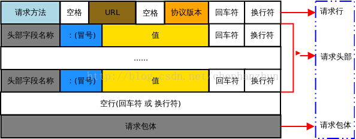
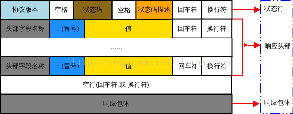

# 计算机网络学习笔记
## 基本概念
**端系统(end system)**
与因特网相连的计算机和其他设备，也称为**主机(host)**

端系统通过**通信链路(communication link)**和**分组交换机(packet-switch)**连接到一起

- **分组交换机** 两种最著名的的类型：**路由器(router)** 和 **链路层交换机(link-layer switch)**

**协议(protocol)** 定义了在两个或多个通信实体之间交换的报文格式和次序，以及报文发送和/或接收一条报文或其他事件所采取的动作

**分组(packet)** 源端将长报文划分为较小的数据块

**存储转发传输机制(store-and-forward transmission)** 在交换机开始向输出链路传输该分组的第一个比特之前，必须接收到整个分组

**电路交换(circut switch)** 在端系统通信会话期间会预留端系统间通信沿路径所需要的资源，通过**频分复用(Frequency-Division Multiplexing)** 或 **时分复用(Time-Division Multiplexing)**实现

**分组交换(packet switching)** 不预留资源

**分组交换网中的结点总时延(total nodal delay)** 

- **处理时延(nodal processing delay)** 检查分组首部和决定将该分组导向何处
- **排队时延(queuing delay)** 队列中分组在链路上等待传输
- **传输时延(transmission delay)** 将所有分组的比特推（传输）向链路，**L/R**
- **传播时延(propagation delay)** 两个路由器之间的距离除以物理媒体的传播速率，**d/s** 

**平均吞吐量(average throughput)** 主机接收到文件所有F比特用去T秒，则平均吞吐量为**F/T bps**

## 应用层

分组： **报文(message)**

**应用程序体系结构** 包括

- **客户-服务器体系结构(client-server architecture)** 有一个总是打开的主机称为*服务器* ，它服务于来自许多其他称为*客户*的主机的请求
- **P2P体系结构** 应用程序在间断连接的主机对之间使用直接通信，这些主机被称为*对等方*

### 进程通信（端系统之间）

**套接字(socket)** 同一台主机内应用层与运输层之间的接口，进程通过该软件接口向网络发送报文和从网络接收报文,(Application Programming Interface, API)

**进程寻址** 

- **IP地址** 主机的地址
- **端口号** 指定运行在接收主机上的接收进程

**应用层协议** 定义了运行在不同端系统上的应用程序进程如何相互传递报文，包括

- 交换的报文类型
- 各种报文类型的语法
- 字段的语义
- 一个进程何时以及如何发送报文，对报文进行响应的规则

### HTTP
**Web**的应用层协议是**超文本传输协议(HyperText Transfer Protocol, HTTP)**

**HTTP** 使用 **TCP** 作为其支撑运输协议

**HTTP** 服务器不保存关于客户的任何信息，因此**HTTP** 是一个**无状态协议**

**非持续连接** 客户与服务器的每个请求/响应对经一个**单独** 的**TCP** 连接发送

**持续连接** 所有请求/响应经**相同** 的**TCP** 连接发送

**往返时间(Round-Trip Time, RTT)** 一个短分组从客户到服务器然后再返回客户所花费的时间

#### 三次握手

> 1 客户向服务器发送一个小**TCP**报文段
> 
> 2 服务器用个小**TCP**报文段做出确认和响应
> 
> 3 客户向服务器返回确认
> 
> 总响应时间：两个**RTT**加上服务器传输**HTML**文件的时间

#### HTTP报文格式
1. HTTP请求报文

    GET /somedir/page.html HTTP/1.1
    Host: www.someschool.edu
    Connection: Close
    User-agent: Mozilla/5.0
    Accept-language: fr

2. HTTP响应报文

    HTTP/1.1 200 OK
    Connection: Close
    Date: Tue, 09 Aug 2019 15:44:04 GMT
    Server: Apache/2.2.3 (CentOS)
    Last-Modified: Tue, 09 Aug 2019 15:11:13 GMT
    Content-Length: 6821
    Content-Type: text/html
    
    (data data data ...)

> 状态码
> - 200 OK
> - 301 Move Permanetly
> - 400 Bad Request
> - 404 Not Found
> - 505 HTTP Version Not Support

## 运输层

分组： **报文段(segment)**

**运输层协议**提供四个方面的**服务**：

- 可靠数据传输
- 吞吐量
- 定时
- 安全性

## 网络层

分组： **数据报(datagram)**

## 链路层

分组： **帧(frame)**

## 物理层

分组： **报文(message)**